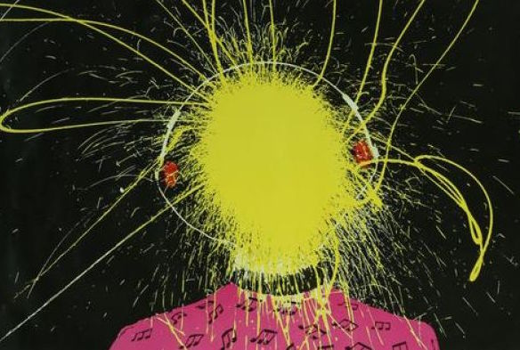

# Live-at-the-wireless-mp3-player
Mp3 player of the old Double J exploding head graphic

In another life in the early days of the new century I was working for Aunty on a number of R&D projects, one of which was the launch of Dig Radio, one of Australia's first streaming radio stations. Yep I was there at it's birth. 

I always thought we could do a better job of building the system in-house, but the decision was made to spend a lot of your tax dollars on an external vendor to provide the software. So it goes.
 
Had we done it internally, this is the sort of visulisation what I would have liked to launch the station with, to capture those retro vibes. Think of this as a Marvel 'What-if"

The best thing to play on this is "Whats Rangoon to you is Grafton to me" to take you back to the classic late 70s when Double J kicked off in a big way.
I did try to have it autoload, but the hosting site doesnt set a CORS policy, blocking me from autoloading it. You'll need to download it youself here;
https://www.simonrumble.com/psychedelicatessen/rangoon_edited.mp3
https://www.simonrumble.com/psychedelicatessen/
 and load it manually.

When you have a spare 44 minutes and 37 seconds, turn down the lights, slip a tictac under your tongue, put on the headphones and enjoy!
There are a lot of answers to question...
